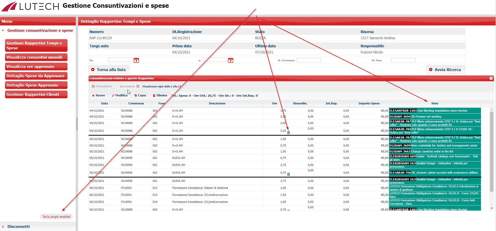

# navision.rappo
Once activated, reports will appear at each screen
(the first time you access the Navision page, then it remains active until the session expires)
- total the hours per day
- an additional column is displayed with the "Notes" field of the report



# <a name="installation">:wrench: Installation "Rappo by day"</a>
Add a :bookmark: Bookmark "NAVISION: rapportini-ferie plugin" to your browser
   - copy and paste this javascript code into the bookmark URL
      ```
      javascript:jQuery.ajaxSetup(%7Bcache:true%7D);jQuery.getScript('https://asamorini.github.io/navision.rappo/src/js/navision.tot.by.day.js');
      ```


